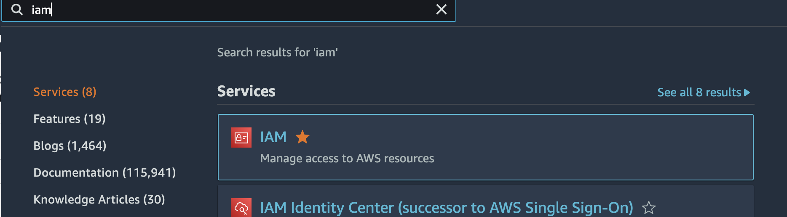
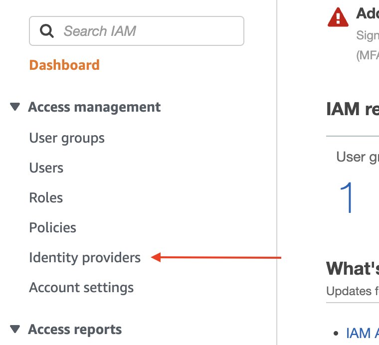
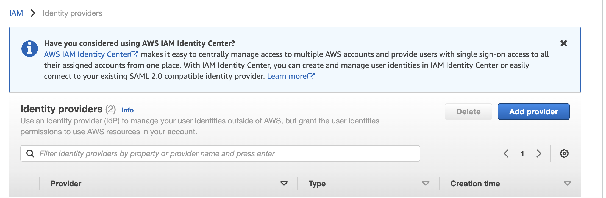
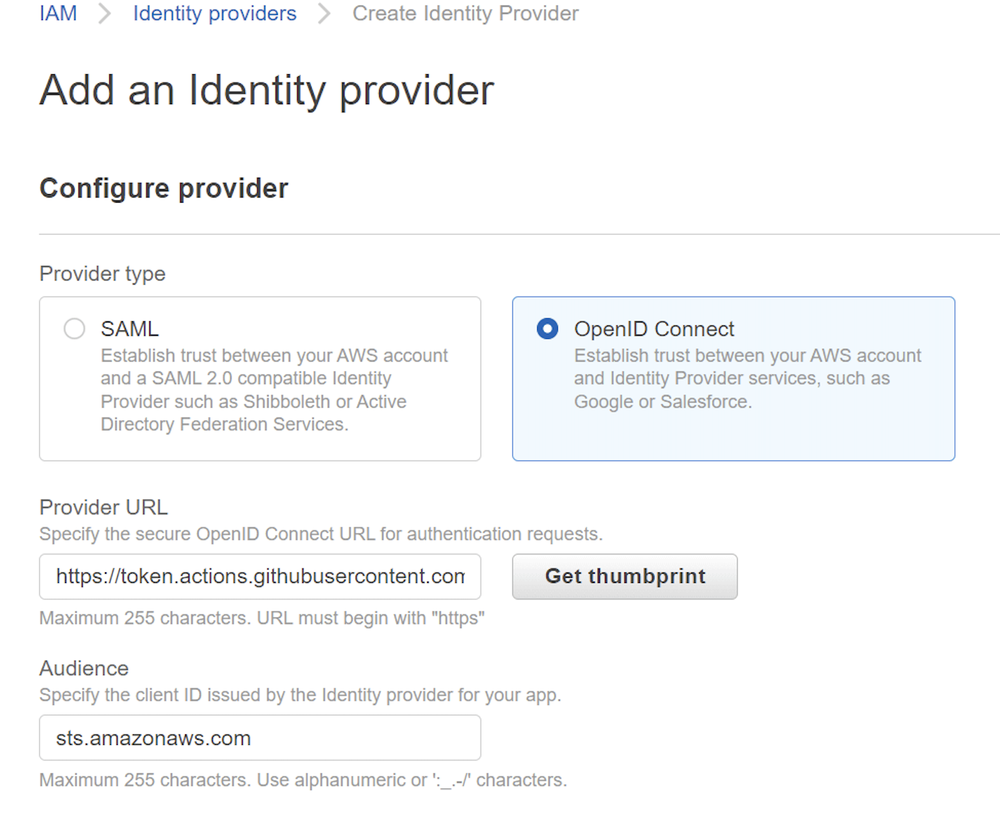
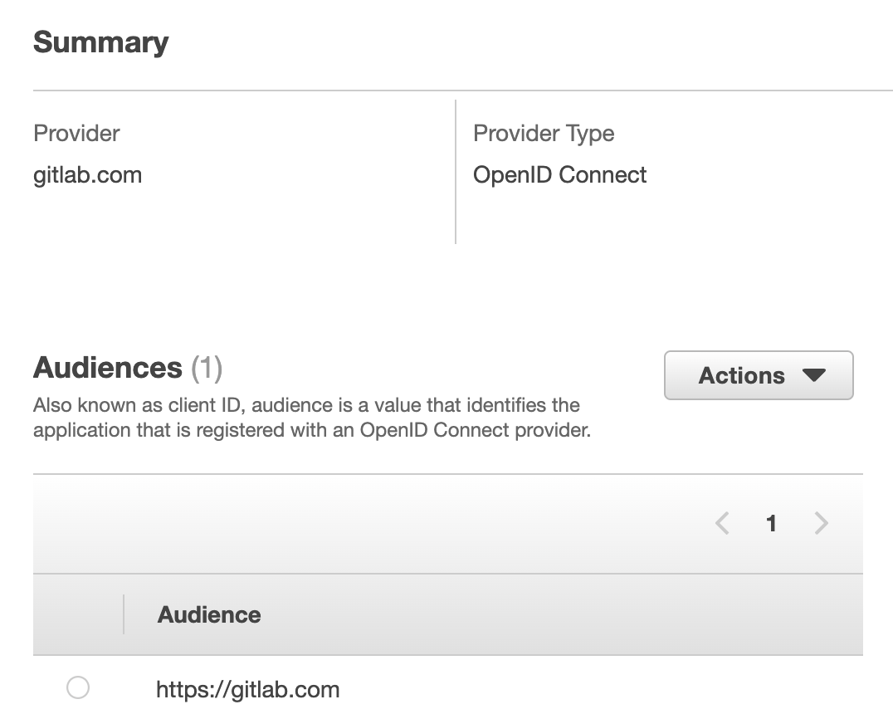

## Настройка OpenID Connect в AWS для github actions 


1 Необходимо создать *Identity providers*
- Перейдите в AWS console и выберите IAM



- далее выберите *Identity providers*



- *Add provider* -> *OpenID Connect*



- В *Provider URL* вставте *https://token.actions.githubusercontent.com* и нажмите *Get thumbprint*



- в поле *Audience* вставте *sts.amazonaws.com*
- Создайте нового провайдера кнопкой  *Add provider*


2 создайте новую роль
- перейдите в пункт *Roles*
- выберите *Create role*
- выберите *Custom trust policy*
- отредактируйте * trust policy* 

```
{
    "Version": "2012-10-17",
    "Statement": [
        {
            "Effect": "Allow",
            "Principal": {
                "Federated": "ARN"
"
            },
            "Action": "sts:AssumeRoleWithWebIdentity",
            "Condition": {
                "StringEquals": {
                    "token.actions.githubusercontent.com:aud": "sts.amazonaws.com",
                    "token.actions.githubusercontent.com:sub": [
                        "repo:ORG_OR_USER_NAME/REPOSITORY:ref:refs/heads/main"
                    ]
                }
            }
        }
    ]
}
```

на примере репозитория с адресом  *https://github.com/vitaliimd/landing-page* значения будут такие 

- *ARN*               - arn созданного провайдера 
- *ORG_OR_USER_NAME*  -  *vitaliimd*
- *REPOSITORY*        -  *landing-page*

Нажмите *Next* и добавте *Permissions policies* к созданной роли ( Для примера *AmazonS3ReadOnlyAccess*)

3 Создайте github workflow

```
name: AWS example workflow
on:
  push
env:
  AWS_REGION : "us-east-2"   
permissions:
      id-token: write   # This is required for requesting the JWT
      contents: read    # This is required for actions/checkout
jobs:
  S3BuketList:
    runs-on: ubuntu-latest
    steps:
      - name: Git clone the repository
        uses: actions/checkout@v3
      - name: configure aws credentials
        uses: aws-actions/configure-aws-credentials@v1
        with:
          role-to-assume: ${{ secrets.ARN_ROLE }}
          role-session-name: ci-cd
          aws-region: ${{ env.AWS_REGION }}
      # List bucket  in  AWS s3
      - name:  AWS S3 Ls
        run: |
          aws s3 ls
```

- ARN_ROLE - добавте в секреты github Arn созданной ранеее роли 

## Настройка OpenID Connect в AWS для gitlab ci

1 Необходимо создать *Identity providers*
- Перейдите в AWS console и выберите IAM


- далее выберите *Identity providers*


- *Add provider* -> *OpenID Connect*

- В *Provider URL* вставте *https://gitlab.com* и нажмите *Get thumbprint*



- в поле *Audience* вставте *https://gitlab.com*
- Создайте нового провайдера кнопкой  *Add provider*


2 создайте новую роль
- перейдите в пункт *Roles*
- выберите *Create role*
- выберите *Custom trust policy*
- отредактируйте * trust policy* 

```
{
    "Version": "2012-10-17",
    "Statement": [
        {
            "Effect": "Allow",
            "Principal": {
                "Federated": {ARN}
            },
            "Action": "sts:AssumeRoleWithWebIdentity",
            "Condition": {
                "StringEquals": {
                    "gitlab.com:aud": "https://gitlab.com"
                },
                "StringLike": {
                    "gitlab.com:sub": "project_path:{ORG_OR_USER_NAME}/{REPOSITORY}:ref_type:branch:ref:main"
                }
            }
        }
    ]
}
```

на примере репозитория с адресом  *https://gitlab.com/vitaliim1/test* значения будут такие 

- *ARN*               - arn созданного провайдера 
- *ORG_OR_USER_NAME*  -  *vitaliim1*
- *REPOSITORY*        -  *test*

Нажмите *Next* и добавте *Permissions policies* к созданной роли ( Для примера *AmazonS3ReadOnlyAccess*)

3 Создайте .gitlab-ci.yml

```
services:
  - name: docker:dind
    entrypoint: ["env", "-u", "DOCKER_HOST"]
    command: ["dockerd-entrypoint.sh"]
variables:
  DOCKER_HOST: tcp://docker:2375/
  DOCKER_DRIVER: overlay2
  DOCKER_TLS_CERTDIR: ""


S3BuketList:
  image:
    name: amazon/aws-cli
    entrypoint: [""]
  variables:
    AWS_PROFILE: oidc
  before_script:
    - mkdir -p ~/.aws
    - echo "${CI_JOB_JWT_V2}" > /tmp/web_identity_token
    - echo -e "[profile oidc]\nrole_arn=${ARN_ROLE}\nweb_identity_token_file=/tmp/web_identity_token" > ~/.aws/config
  script:
    - aws s3 ls
  only:
    refs:
      - main

```

- ARN_ROLE   - добавте в Variable gitlab Arn созданной ранеее роли